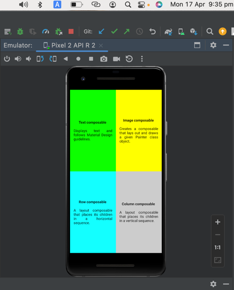

# ComposeQuadrant

Practice Compose Basics

### References

- [Compose quadrant](https://developer.android.com/codelabs/basic-android-kotlin-compose-composables-practice-problems#3)
- [Weight modifier](https://developer.android.com/reference/kotlin/androidx/compose/foundation/layout/RowScope?hl=ja#(androidx.compose.ui.Modifier).weight(kotlin.Float,kotlin.Boolean))
- [FontWeight.Bold](https://developer.android.com/reference/kotlin/androidx/compose/ui/text/font/FontWeight#Bold())
- [TextAlign.Justify](https://developer.android.com/reference/kotlin/androidx/compose/ui/text/style/TextAlign#Justify())
